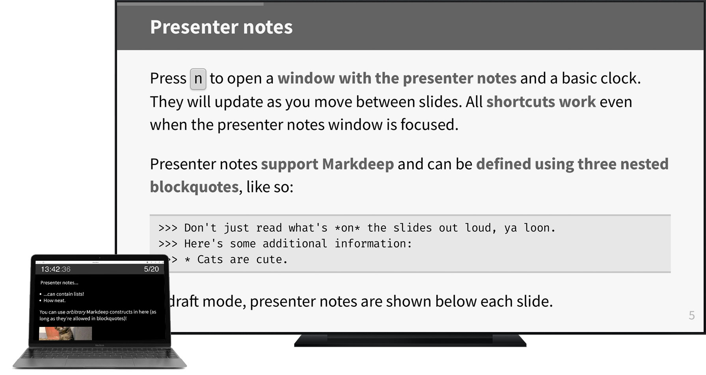

# markdeep-slides

*Build presentation slides with [Markdeep](https://casual-effects.com/markdeep/) and present them right in your browser.*



* Two modes:
    * **Draft** – with inline presenter notes, useful as a preview when building slides.
    * **Presentation** (shown to the right) – full-screen, with your *presenter notes in a separate window*.
    * You can also **generate a PDF version** of your slides.
* **Keyboard shortcuts** for all relevant functions (see below).
* Supports **all features [Markdeep](https://casual-effects.com/markdeep/) has to offer** – diagrams, math, inline videos, citations, admonitions, and all the standard Markdown stuff.
* If you don't like any of the built-in themes: **Style your slides with CSS!** LaTeX and Beamer are great, but things can get tricky. *Let's not talk about PowerPoint* and its various knockoffs.
* The full power of CSS animations and JavaScript is at your fingertips – use it wisely.
* **3 built-in themes** – but you can also make your own with a couple dozen lines of CSS.
* Compatible with those little [presenter gadgets](https://www.amazon.com/Logitech-Wireless-Presenter-Presentation-Pointer/dp/B00B6MODOA/).


#### **Demo:** Try it out [right here on GitHub Pages](https://doersino.github.io/markdeep-slides/demo.md.html)!


## Getting started

### Setup

This repository contains **copies of all dependencies** (Markdeep, MathJax, and the webfonts used by the built-in themes) by design – it'll **work offline** (unless you include YouTube videos or something in your slides). *You don't want to rely on wifi being available when and where you'll present – that's just asking for trouble.*

#### [📦](https://github.com/doersino/markdeep-slides/archive/master.zip) Clone this repository or [download a ZIP](https://github.com/doersino/markdeep-slides/archive/master.zip).

Then simply...

1. **navigate** to `demo.md.html`,
2. **open** it in your text editor and browser of choice, and
3. **start building your slides**. Easy!


### Shortcuts

Use the following **keyboard shortcuts** to steer your presentation. Press...

* <kbd>Space</kbd>, <kbd>↓</kbd>, <kbd>→</kbd> or <kbd>PgDn</kbd> to go to the **next slide**,
* <kbd>↑</kbd>, <kbd>←</kbd> or <kbd>PgUp</kbd> to go to the **previous slide**,
* <kbd>F</kbd>, <kbd>F5</kbd> or <kbd>Esc</kbd> to **enter or exit fullscreen/presentation mode**,
* <kbd>.</kbd> to turn the screen **black** (and back again), and
* <kbd>n</kbd> to open or close a window with your **presenter notes**,
* <kbd>t</kbd> to start or dismiss a **timer** counting up from zero seconds (shown in the presenter notes window), and
* a slide number, e.g. <kbd>1</kbd> <kbd>7</kbd>, followed by <kbd>Enter</kbd>, to **jump** directly to that slide.


### Options

At the bottom of `demo.md.html`, right before a bunch of essential JavaScript files are loaded, you'll find a set of options:

```html
<script>
markdeepSlidesOptions = {
    aspectRatio: 16 / 9,  // aspect ratio of your slides
    theme: 'simple',      // theme – "simple", "serif" or "deepsea"
    fontSize: 28,         // base font size
    diagramZoom: 1.0      // markdeep diagram scaling factor
};
</script>
```

Modify them to your liking, but don't decrease the font size too much (nobody wants to read novel-length slides). Additionally, you can tweak some aspects of each theme by overriding CSS variables – take a look at the relevant file in `markdeep-slides/themes/`.


## Contributing

Got an idea on how to improve something? Ran into unexpected behavior? Found a bug? (Maybe even fixed that bug?)

*Please [file an issue](https://github.com/doersino/markdeep-slides/issues) or send a pull request! I'll be glad to take a look at it.*


---


### Notes

* **Tested** in recent versions of Chrome, Firefox and Safari. I don't have access to Edge/IE, so you're on your own there (although I suspect that folks interested in building their slides with Markdeep aren't using these browsers anyway). Not really made for mobile use, although scrolling through slides in draft mode works fine.
* I **recommend using Chrome for generating a PDF version** of your slides – it uses the page size that's automatically specified in CSS based on your chosen aspect ratio, unlike all other browsers. In Chrome's print window, set "Margins" to "None" and make sure to keep the "Background graphics" option enabled.
* The included variant of **MathJax** has been [heavily stripped down](https://github.com/mathjax/MathJax-docs/wiki/Guide:-reducing-size-of-a-mathjax-installation/1814429ed1e97bfb7675c0fd400804baa9287249) and only allows SVG as the output format. This was done to keep the size to a minimum and because SVG output looks best (other formats may be more accessible, but that doesn't matter in a presentation context).
* If your **presenter** gadget doesn't work here, please go to https://keycode.info and record *1. which keycodes each button sends, 2. what happened, 3. what you expected to happen* and file an issue accordingly.


### Making your own theme

* If you're making your own themes, make sure that all `font-size`s, `margin`s, `padding`s, `width`s, `height`s and other sizes are **defined in terms of `rem`, `em`, or `%`**. This enables your elements to scale properly depending on screen size. So don't use `px`, `pt`, or `mm`.
* Also don't use `vw` and `vh` as size units – depending on the aspect ratio of your display and your slides, your **slides will be [letterboxed](https://en.wikipedia.org/wiki/Letterboxing_(filming))**, so `100vh` might be larger than the width of your slides (the same goes for height). The actual slide width and height can be read from the CSS variables `var(--slide-width)` and `var(--slide-height)`, respectively.
* Use CSS `var`iables to keep your theme configurable (take a look at the existing themes to see some examples).
* If you want your slides to have a non-white background, set it on the `body` selector as opposed to the `.slide` selector. This prevents small gaps caused by rounding errors from showing up in exported PDFs.
* Keep in mind that the presenter notes will inherit your theme's styles. You can override specific styles by targeting the `.presenter-notes` class.
* **Download any webfonts to your computer.** Again, *you don't want to rely on wifi being available when and where you'll present*. I recommend using [this tool](https://google-webfonts-helper.herokuapp.com/fonts) to download webfonts from Google Fonts.


### Known issues

If you know of an elegant way of fixing these, I'd very much appreciate a heads up.

* When resizing the window in Safari in draft mode, the font size is not scaled accordingly. No idea why – it's defined in terms of `vw` units in CSS, so it *should* scale as the viewport width changes. It does in all other browsers, anyway.
* When leaving fullscreen mode in Firefox using <kbd>Esc</kbd>, presentation mode often persists. No idea why – leaving it by pressing <kbd>f</kbd> fires the same event, so the same stuff *should* happen.
* After refreshing while in fullscreen mode in Safari, the only way to exit fullscreen mode is clicking the green button – and even after that, presentation mode persists because the `webkitfullscreenchange` event does not fire in this situation. (Other browsers exit fullscreen mode upon refresh, making this a non-issue there.)
* Firefox, when applying an `invert()` filter to two selectors referring to elements that may contain each other, applies the filter to both elements seperately, i.e. the filter cancels itself out. Other browsers do the "right" thing. This affects code snippets with line numbers when using the `deepsea` theme.


### License

Where not otherwise noted, you may use this repository's contents under the terms of the *BSD 2-Clause "Simplified" License*, see `LICENSE`.

However, the subdirectory `markdeep-slides/lib/` contains **third-party software with its own licenses**:

* Morgan McGuire's **Markdeep** is *also* licensed under the *BSD 2-Clause "Simplified" License*, see [here](https://casual-effects.com/markdeep/#license).
* Markdeep includes Ivan Sagalaev's **highlight.js** with its *BSD 3-Clause License*, see [here](https://github.com/highlightjs/highlight.js/blob/master/LICENSE).
* **MathJax** is licensed under the *Apache License 2.0*, see [here](https://github.com/mathjax/MathJax/blob/master/LICENSE).
* All included **webfonts** (IBM Plex Mono, Iosevka, Libre Franklin, Source Sans Pro, Source Serif Pro, Vollkorn) are licensed under the *SIL Open Font License*, see [here](https://scripts.sil.org/cms/scripts/page.php?site_id=nrsi&id=OFL_web).
